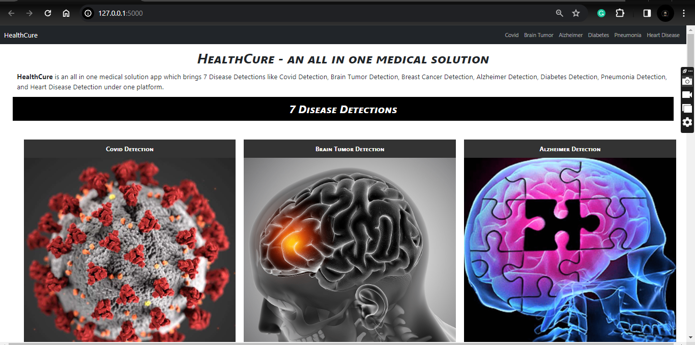
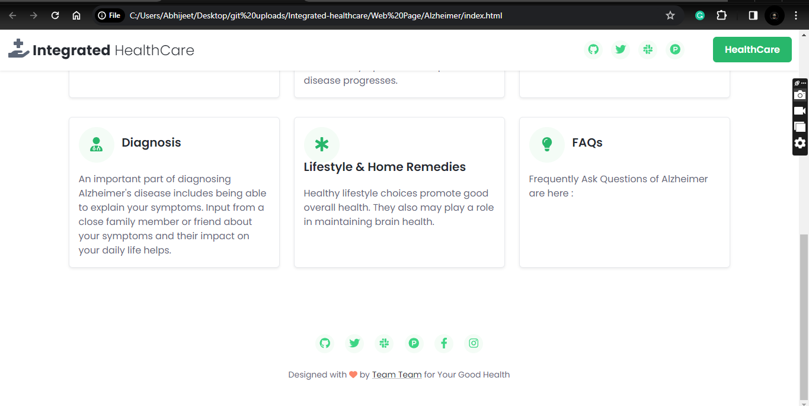
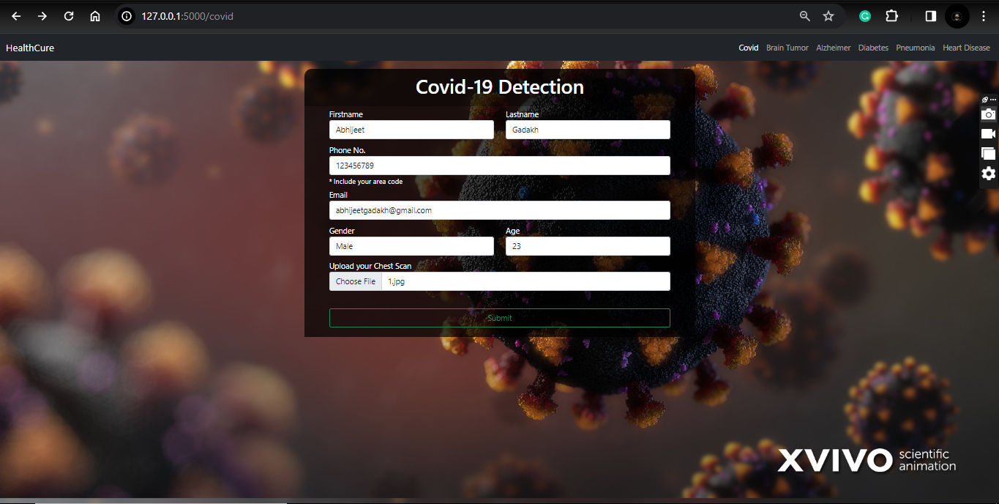
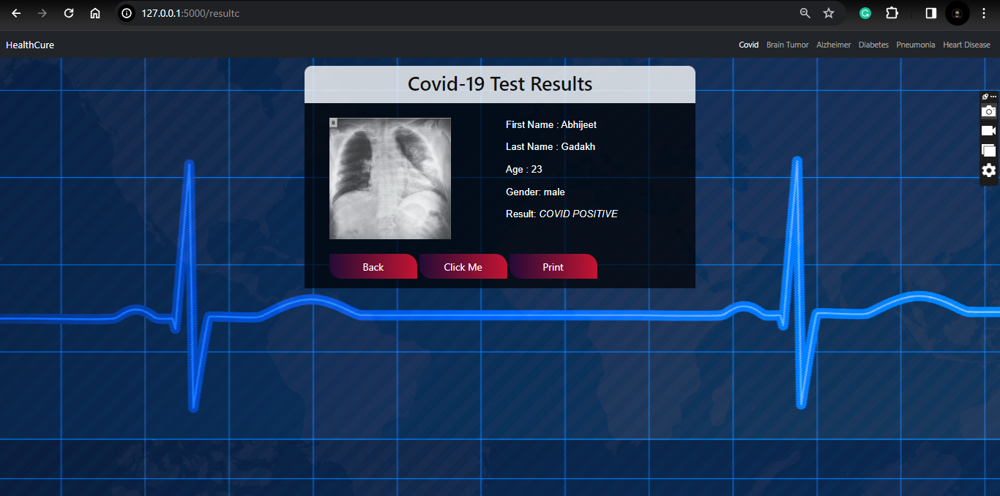
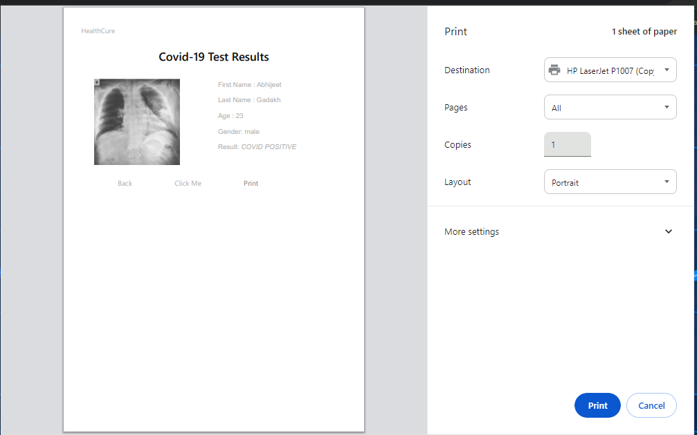

# Integrated-healthcare
multiple disease prediction

  

•This repository consists of files required to deploy a **Web App** created with **Flask **.# Integrated_healtcare_System The Project employs machine learning and deep learning to predict Alzheimer's, Brain Tumor, COVID-19, Diabetes, Heart Disease, and Pneumonia, providing early and accurate disease detection for proactive medical intervention and improved patient outcomes. This user-friendly system seamlessly integrates diverse medical data, revolutionizing healthcare for more efficient diagnostics and personalized care..

•Through the power of advanced algorithms and deep learning models, our system analyzes diverse medical data, including imaging, clinical records, and patient history. The seamless integration of multiple diagnostic modalities ensures a comprehensive approach to disease prediction. In a world where early detection is key to effective treatment, the Integrated Healthcare System stands as a beacon of progress, merging technology and healthcare for a healthier and more resilient society......

### Problem Statement/Oppurtunity:
• Our project tackles the problem of identifying serious diseases like Alzheimer's, Brain Tumor, COVID-19, Diabetes, Heart Disease, and Pneumonia early on. Currently, there's a challenge in quickly and accurately diagnosing these conditions. We use advanced technology like machine learning to create a user-friendly system that can predict these diseases, helping doctors and individuals take action sooner for better health outcomes.

# Home Page :

## Disease Discription Pages :
 

#### Covid-19 Result :

## Analysis:
1. The classification models showed high accuracy in identifying Covid, brain tumor,
Alzheimer's, Pneumonia, Diabetes, and heart disease.
2. Random Forest algorithm performed well in predicting Diabetes and heart disease.
3. Convolutional Neural Networks performed well in predicting all other diseases.
4. The GUI developed using HTML, CSS, and Bootstrap, integrated with Flask, makes it easy for
users to interact with the disease prediction models.
5. The CNN models used for Covid, brain tumor, Alzheimer's, and Pneumonia, were trained on
image datasets, and have the potential to provide accurate diagnoses using medical imaging.
6. The accuracy of the classification models can be further improved by increasing the size and
diversity of the training datasets, optimizing hyperparameters, and using other advanced
machine learning algorithms

## SYSTEM REQUIREMENT:
### SOFTWARE & PLATFORM REQUIREMENTS:
1. Operating System: Windows OS .
2. Platform: Visual Studio Code / Python IDLE, Jupyter Notebook.
3. Frontend Language: - HTML, CSS, JavaScript, Bootstrap .
4. Framework Used:- Flask.
5. Backend Language and Libraries: - Python 3.8+, Pandas, Numpy, Tensorflow, Keras, Scikit-learn. Cv2, OpenCV, Flask Framework, Matplotlib.

### HARDWARE REQUIREMENTS
6. Processor: INTEL Pentium 4 Core Processor.
7. Hard Disk: Minimum 100 GB and above.
8. RAM: Minimum 256 GB and above

## Conclusion:
The project successfully achieved its objectives by utilizing machine learning and deep learning techniques to develop a highly efficient medical system with a user-friendly interface..

#                                            Thank You

